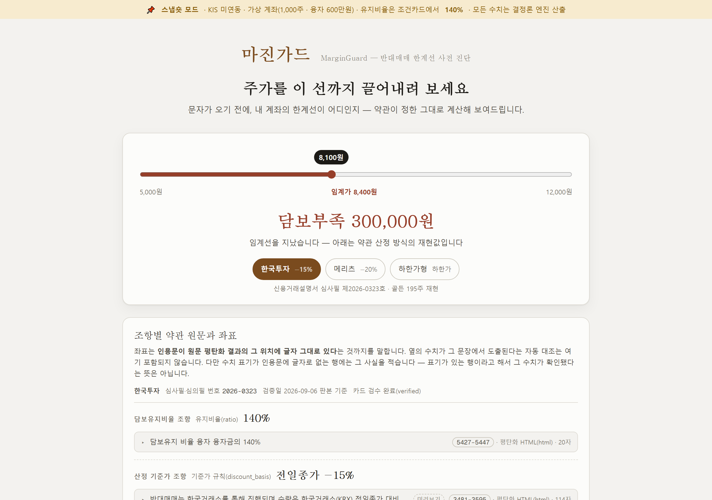
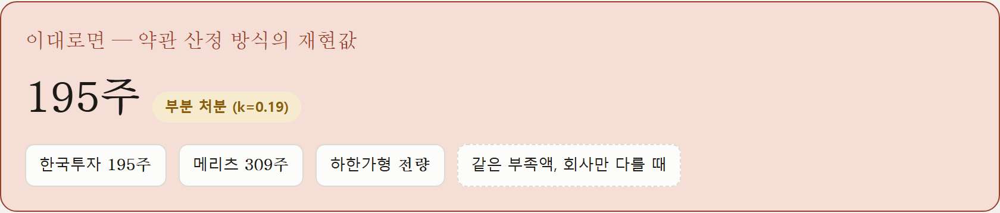
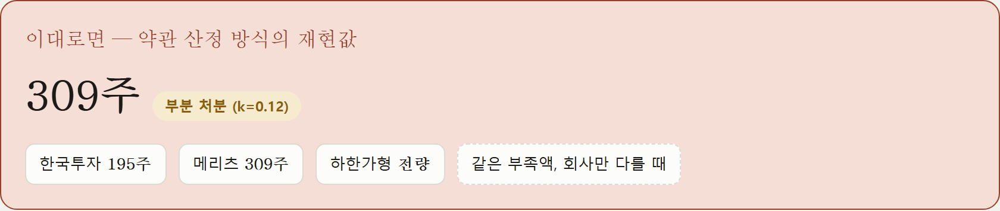
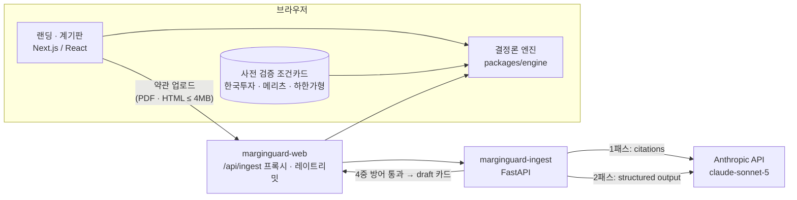
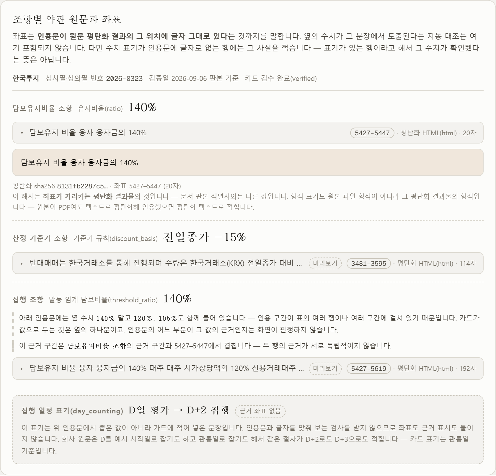
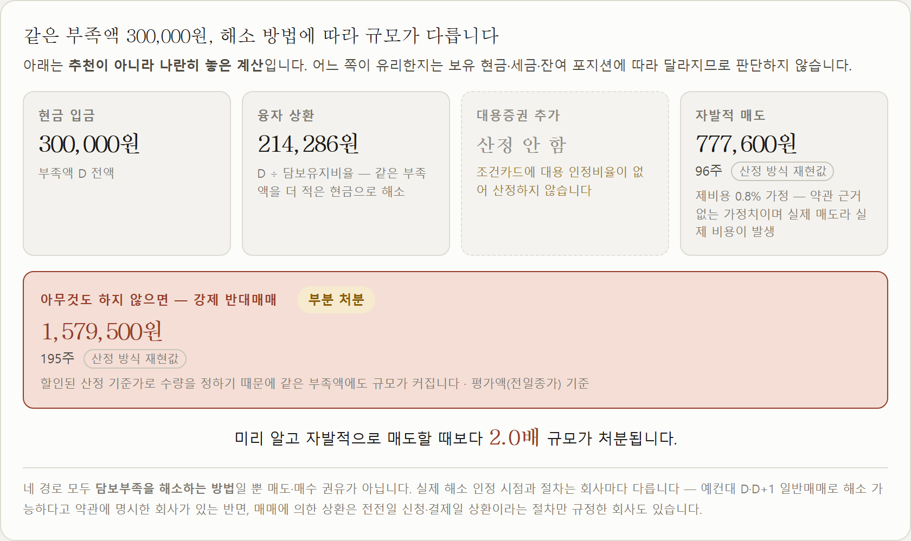
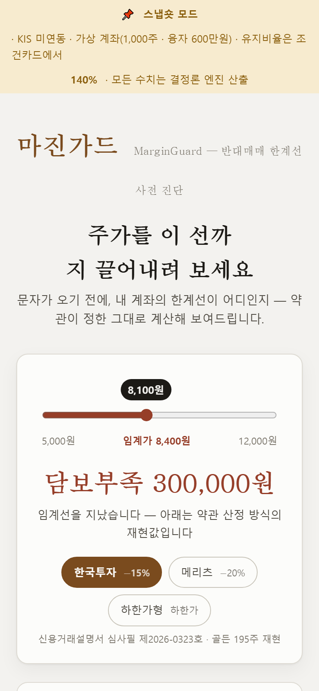
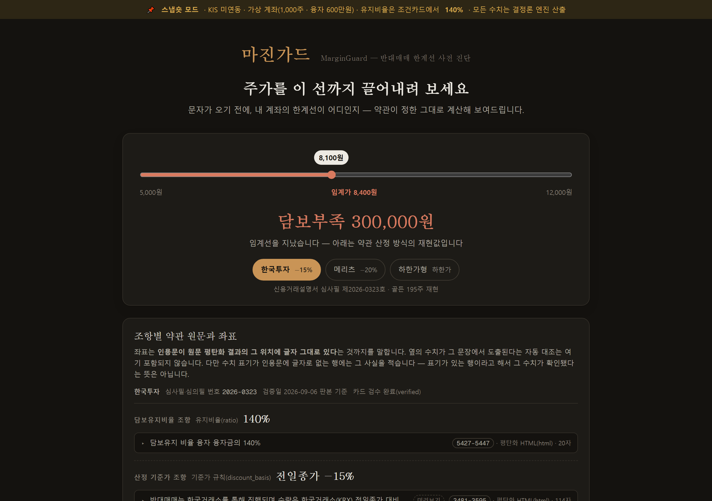

<div align="center">

# 마진가드 · MarginGuard

**증권사 약관은 AI가 읽고, 반대매매 한계선은 결정론 엔진이 계산하는 웹 시뮬레이터**

2026 금융 AI Challenge 출품작 · 4인 팀 · 2026.08.05 – 09.07

[](https://github.com/jaepaly/AI_Challenge/actions/workflows/ci.yml)


</div>



## 무엇을 하나

신용융자 약관에는 *"담보유지비율 140%"* 라고만 적혀 있습니다. **내 계좌가 주가 얼마에서 담보부족이 되는지, 그때 몇 주가 강제로 팔리는지**는 보유 수량·융자금·증권사별 처분 가격 기준을 함께 넣어야 나옵니다.

마진가드는 그 계산을 **가격 슬라이더 하나**로 보여 줍니다. 슬라이더를 내리면 임계가에서 화면이 바뀌고, 담보부족액·강제처분 수량·해소 방법 네 가지가 즉시 갱신됩니다. 모든 수치 옆에는 **그 값이 나온 약관 원문 문장과 문자 좌표**가 붙습니다.

## 같은 계좌, 같은 부족액 — 약관만 바꾸면

<table>
<tr>
<td width="50%"></td>
<td width="50%"></td>
</tr>
<tr>
<td align="center"><b>한국투자</b> — 전일종가 −15% 기준 → <b>195주</b></td>
<td align="center"><b>메리츠</b> — 전일종가 −20% 기준 → <b>309주</b></td>
</tr>
</table>

가상 계좌(1,000주 · 융자 600만원 · 주가 8,100원)의 담보부족액은 두 경우 모두 **300,000원**입니다. 달라진 것은 약관이 정한 **처분 가격 기준 하나**뿐인데, 팔려 나가는 수량은 1.6배가 됩니다. 이 차이는 증권사 앱 안에서는 볼 수 없습니다 — 자사 조건만 보여 주니까요.

## 핵심 설계 — 네 가지 결정

### 1. AI는 읽고 인용만 한다. 계산은 엔진이 한다

금융 수치를 LLM이 만들면 그 값이 왜 나왔는지 검증할 수 없습니다. 그래서 역할을 구조적으로 나눴습니다.

| | 생성형 AI (Claude) | 결정론 엔진 (TypeScript) |
|---|---|---|
| 하는 일 | 약관에서 유지비율·처분 가격 기준을 찾아 **인용과 좌표로** 낸다 | 부족액·처분 수량·해소 경로·한계선을 **계산**한다 |
| 못 하는 일 | 계산 · 산식 작성 — **출력에 산식이 섞이면 카드 전체를 거부** | 약관을 읽지 않는다 |

```
담보부족액  D = r·L − V
계수        k = r(1 − h) − 1
처분 수량   n = ⌈ D / (P_prev · k) ⌉        k ≤ 0 이면 전량(FULL)
```

### 2. 근거 좌표는 모델이 아니라 API가 준다

모델에게 *"이 문장은 5427번째 글자에 있다"* 고 보고하게 하면 그 좌표도 생성물이라 틀릴 수 있습니다. Anthropic Messages API의 **citations** 기능은 인용 위치를 API가 돌려주므로 원문과 기계적으로 대조할 수 있습니다.

다만 citations 와 structured outputs 는 한 호출에서 함께 쓸 수 없어서(400) **두 번 부릅니다** — 1패스에서 인용을 모으고, 2패스에서 그 인용만으로 조건카드 JSON을 조립합니다.

### 3. 모르는 것을 모른다고 말한다

대부분의 서비스는 답을 내는 쪽으로 기울어 있습니다. 마진가드는 세 자리에서 **계산하지 않기를 선택**합니다.

| 게이트 | 언제 | 화면 |
|---|---|---|
| 신선도 | 조건카드 검증일로부터 30일 초과 | 강제처분 수량을 내지 않고 재검증이 필요하다고 말한다 |
| 유지비율 미확정 | 한 문서가 같은 상품에 두 비율을 적어 하나로 못 정할 때 | 후보를 그대로 보여 주고 **하나를 골라 주지 않는다** |
| 검수 전 카드 | AI가 만든 카드는 **무조건 `draft`** | 계산은 하되 «참고 모드» 배너를 붙인다 |

### 4. AI 출력에 4중 방어

```
① 모든 수치에 근거 좌표(인용 + 문자 위치 + 문서 해시)   못 찾으면 카드 전체 거부
② JSON Schema + Pydantic 이중 검증
③ 수치 범위 검사                                     유지비율 1.0~2.0 · 할인율 0~0.35
④ 산식 혼입 거부                                     AI 출력에 계산식이 섞이면 거부
```

## 아키텍처



기본 화면은 **외부 호출 0회**입니다 — 사전 검증 카드와 브라우저 안의 엔진만으로 돕니다. AI는 사용자가 자기 약관을 올릴 때만 호출됩니다(1건 30~70초 · 약 310원, 실측).

## 화면

<table>
<tr>
<td width="55%"></td>
<td width="45%"></td>
</tr>
<tr>
<td><b>근거 패널</b> — 인용문 · 문자 좌표 · 평탄화 해시 · 판본. 인용 구간에 다른 수치가 섞여 있으면 그 사실도 적는다</td>
<td><b>해소 4경로</b> — 같은 부족액을 입금·상환·대용증권·자발적 매도로 풀 때의 규모. 추천이 아니라 나란히 놓은 계산</td>
</tr>
</table>

<table>
<tr>
<td width="30%"></td>
<td width="70%"></td>
</tr>
<tr>
<td align="center">모바일 (390px)</td>
<td align="center">다크 모드</td>
</tr>
</table>

> 라이브 데모는 대회 기간(2026.08.26 – 09.11) 동안 운영했습니다. 스크린샷은 2026-09-28 배포본에서 캡처했습니다.

## 검증 — 검사를 검사한다

```
npm test                  engine 121 + web 293 = 414 passed
pytest services/ingest    237 passed / 273 subtests
Playwright E2E            17 케이스 × Chromium · Firefox · 375px
                          (2026-09-28 · main 기준)
```

숫자보다 중요하게 여긴 것은 **검사가 정말 무언가를 잡는가**였습니다. 새 가드를 넣을 때마다 코드를 일부러 망가뜨려 그 가드가 빨간불이 되는지 확인했고(main 커밋 108개 중 29개에 뮤테이션 기록), 그 과정에서 *검사가 자기가 검사하려는 것에 속는* 경우를 여러 번 찾았습니다.

실제로 잡은 것들:

- **근거 9개 중 4개가 약관 조항이 아니라 계산 예시를 인용**하고 있었다 — 좌표·해시는 맞았다. 인용 구간이 «예시 영역»과 겹치는지 보는 검사를 추가했다
- **PDF 추출기 패치 릴리스 하나가 근거 좌표 9개를 동시에 무효화**했다 — 추출기를 정확 버전으로 고정하고 CI가 원문을 매번 다시 파싱하게 했다
- **우리 코드 변경 없이 CI가 깨졌다** — 테스트가 직접 쓰는 라이브러리가 다른 패키지의 전이 의존으로만 들어와 있었다. 직접 import 하는 것은 직접 선언하는지 보는 검사를 만들었다
- **증권사 원문이 대회 중 개정됐다**(124KB HTML → 5.9MB 렌더). 값은 그대로였지만 좌표가 전부 바뀌었다 — 옛 판본은 보존하고, 새 근거는 현행본에서만 뜨게 검사로 묶었다
- **심사 5일 중 사흘이 신선도 게이트에 막힐 예정**이던 것을 준비도 API의 예보로 미리 찾아, 심사 전날 원문을 다시 받아 해시 대조 후 재검증했다
- **업로드 API는 200을 냈지만 사람은 버튼을 못 찾았다** — CSS 리셋이 파일 선택 버튼을 흐린 글자로 만들었다. `curl` 로 확인한 것과 사람이 보는 것은 달랐다

## 팀

| 역할 | 이름 | 맡은 것 |
|---|---|---|
| **A · 엔진/도메인** | 김재현 [@dsaedsae](https://github.com/dsaedsae) | 경로 재생, 다종목 배분, 신선도 게이트, 카드 → 계산 배선, 코드 리뷰 |
| **B · AI 파이프라인** | 서승기 [@HUI4537](https://github.com/HUI4537) | 약관 인제스트(2패스), 근거 좌표 계약, 4중 방어 |
| **C · 플랫폼/연동** | 이예찬 [@securitychan](https://github.com/securitychan) | Next.js 앱 골격, KIS 프록시 보안, 인제스트 헬스 가드, 배포 계정 |
| **D · 프로덕트/검증** | **박재현 (팀장)** [@jaepaly](https://github.com/jaepaly) | 엔진 골격, UI, E2E · 가드 검사, 제출 문서 원고, 팀 운영 |

역할은 첫날(2026-08-05) 추첨으로 정했습니다. 네 트랙은 `packages/engine/src/types.ts` 의 **경계 타입**(`ConditionCard` · `RiskResult` · `Position`)으로 격리해 목(mock)으로 병렬 개발했고, 경계 타입 변경은 PR + 전원 승인으로 묶었습니다.

아래 기여는 저장소의 PR · 리뷰 기록에서 뽑았습니다. 링크가 그 PR 입니다.

### A · 김재현 — 엔진/도메인

- **경로 재생** — 가격 갱신 → 종가 판정 → D+1 통지 → D+2 집행을 날짜 순서대로 밟는 `replay()`. 화면의 «7월 연쇄 재현»이 이 함수로 돈다 ([#8](https://github.com/jaepaly/AI_Challenge/pull/8))
- **신선도 게이트** — 검토일이 30일을 넘거나 없으면 처분 수량을 막는 규칙 ([#8](https://github.com/jaepaly/AI_Challenge/pull/8)). 화면 배너가 허용 한도를 손으로 적지 않고 엔진 상수를 쓰게 했다 ([#58](https://github.com/jaepaly/AI_Challenge/pull/58))
- **다종목과 카드 배선** — 종목번호 순 정수 배분 ([#23](https://github.com/jaepaly/AI_Challenge/pull/23)), 계기판 입력의 단일 진입점 `assembleRiskResult` ([#33](https://github.com/jaepaly/AI_Challenge/pull/33)), 카드가 읽은 유지비율이 실제 계산을 구동하게 한 `policyRatio` ([#83](https://github.com/jaepaly/AI_Challenge/pull/83)), 메리츠 카드의 종목군별 분리 ([#95](https://github.com/jaepaly/AI_Challenge/pull/95))
- **의존성 · 기록 가드** — 직접 의존의 검증 범위를 기계로 지키는 검사 ([#65](https://github.com/jaepaly/AI_Challenge/pull/65), [#78](https://github.com/jaepaly/AI_Challenge/pull/78)), 유료 재실행이 이전 성공 기록을 덮지 못하게 하는 보호 ([#82](https://github.com/jaepaly/AI_Challenge/pull/82))
- **리뷰와 제출 최종본** — 54개 PR 을 리뷰했고 그중 15개에 변경을 요청했다. 탐침을 돌려 결함을 증명하는 리뷰였다(예: 제출 문서 생성기의 fail-open, [#105](https://github.com/jaepaly/AI_Challenge/pull/105)). 제출한 기획서 · 기능명세서는 A 가 한글에서 문장을 다시 짜 최종본으로 만들었다

### B · 서승기 — AI 파이프라인

- **2패스 인제스트** — `POST /ingest`. 1패스가 citations 로 근거를 모으고, 서버가 조항 구간을 확정한 뒤, 2패스 structured output 이 그 후보 안에서만 카드를 만든다. 4중 방어를 통과해야 draft 카드가 나온다 ([#47](https://github.com/jaepaly/AI_Challenge/pull/47))
- **근거 좌표 계약** — PDF 페이지 좌표와 HTML 문자 좌표를 가르는 `EvidenceSpan`, 평탄화 원문의 SHA-256, TS · JSON Schema · Pydantic 세 미러 동기화. HTML 표의 행 · 셀 경계를 복원하는 파서와 비율 인용문의 수치 검증 ([#26](https://github.com/jaepaly/AI_Challenge/pull/26))
- **실측으로 경로 결정** — PDF 5건을 Message Batches 로 돌려 비용 상한을 걸고, 출력이 잘린 실행은 결론에서 분리했다 ([#43](https://github.com/jaepaly/AI_Challenge/pull/43))
- **종단 성공과 비용 원장** — 최신 프롬프트로 유료 실행 1회, 한투 약관에서 draft 카드까지 43.8초로 60초 기준을 통과했다 ([#92](https://github.com/jaepaly/AI_Challenge/pull/92)). 실청구액 원장 ([#94](https://github.com/jaepaly/AI_Challenge/pull/94))과 유진 약관의 상품 결속 회귀 복구 ([#60](https://github.com/jaepaly/AI_Challenge/pull/60))

### C · 이예찬 — 플랫폼/연동

- **앱 골격과 KIS 연동** — `apps/web` Next.js 앱을 세우고, KIS 거래 ID 를 용도별 레지스트리로 관리하는 가드를 만들었다. 등록되지 않은 ID 는 모든 환경에서, 실전 환경의 거래성 호출은 전부 차단한다. BFF 라우트 4종, 토큰 캐시, 요청 큐와 백오프 ([#5](https://github.com/jaepaly/AI_Challenge/pull/5))
- **프록시 보안** — 계좌 라우트 인증, 응답 allowlist 필터, 외부 호출 5초 타임아웃 ([#39](https://github.com/jaepaly/AI_Challenge/pull/39))
- **인제스트 헬스 가드** — 키 유효성만 확인하고 키와 오류 본문은 내보내지 않는 `/api/ingest/health`. 크레딧을 쓰지 않고 강등 경로를 리허설하는 장애 주입 훅 ([#29](https://github.com/jaepaly/AI_Challenge/pull/29))
- **배포 운영** — Vercel 배포 계정을 운영했고, 빌더 동작을 실측해 배포 방식 결정의 근거를 댔다 ([#85](https://github.com/jaepaly/AI_Challenge/pull/85), [#89](https://github.com/jaepaly/AI_Challenge/pull/89)). 11개 PR 을 플랫폼 · 보안 관점으로 리뷰했다

### D · 박재현 (팀장) — 프로덕트/검증

- **엔진 골격** — 첫날 모노레포와 결정론 엔진의 핵심 산식(부족액 · 처분 수량 · 해소 4경로 · 한계선)을 세우고 골든 테스트 10건을 green 으로 시작했다. 네 트랙은 그 위에서 갈라졌다 ([8eeddf3](https://github.com/jaepaly/AI_Challenge/commit/8eeddf3)). 다종목 한계선 분해 ([#37](https://github.com/jaepaly/AI_Challenge/pull/37))와 카드 · 원장의 유지비율이 어긋나면 처분 수량만 막는 정합 게이트 ([#55](https://github.com/jaepaly/AI_Challenge/pull/55))
- **UI** — 가격 슬라이더와 판정 카드 ([#2](https://github.com/jaepaly/AI_Challenge/pull/2), [#10](https://github.com/jaepaly/AI_Challenge/pull/10)), 해소 4경로 비교 ([#14](https://github.com/jaepaly/AI_Challenge/pull/14)), 신선도 · 참고 모드 배너 ([#30](https://github.com/jaepaly/AI_Challenge/pull/30)), 근거 패널 ([#52](https://github.com/jaepaly/AI_Challenge/pull/52)), 업로드 패널 ([#80](https://github.com/jaepaly/AI_Challenge/pull/80)). «안전 여유를 먼저, 임계점을 나중에» 같은 표시 규약을 정했다
- **검증** — Playwright E2E(Chromium · Firefox · 375px) ([#75](https://github.com/jaepaly/AI_Challenge/pull/75), [#91](https://github.com/jaepaly/AI_Challenge/pull/91)), 제출 문서가 코드 · 원문과 어긋나지 않는지 보는 가드 ([#57](https://github.com/jaepaly/AI_Challenge/pull/57), [#66](https://github.com/jaepaly/AI_Challenge/pull/66)), 배포본이 실제로 답을 내는지 보는 무중단 폴링 ([#56](https://github.com/jaepaly/AI_Challenge/pull/56)). 가드를 뮤테이션으로 검증하는 관행을 들였다
- **제출 문서 원고** — 기획서 · 기능명세서 원고 ([#77](https://github.com/jaepaly/AI_Challenge/pull/77), [#88](https://github.com/jaepaly/AI_Challenge/pull/88)). 공식 `.hwpx` 양식을 원고에서 생성하는 파이프라인을 만들어 손으로 채우며 생기던 오류(겹친 문단, 남은 작업 지시문)를 없앴다 ([#105](https://github.com/jaepaly/AI_Challenge/pull/105))
- **팀 운영과 장애 대응** — 트랙 분리와 경계 계약, 게이트 일정, «PR 리뷰 1인 이상» 규약. 대회 기간 머지된 PR 84개 중 82개를 최종 머지했다. 상류 릴리스가 깬 main 복구 ([#61](https://github.com/jaepaly/AI_Challenge/pull/61), [#76](https://github.com/jaepaly/AI_Challenge/pull/76)), 호스팅 플랜 정책에 따른 배포 차단 진단 ([#104](https://github.com/jaepaly/AI_Challenge/pull/104)), CI 8일 정지(«실패»가 아니라 «시작되지 않음») 진단, 심사 전날 조건카드 재검증 ([#106](https://github.com/jaepaly/AI_Challenge/pull/106))

## 한계 — 숨기지 않은 것

- **가상 계좌**다. 실계좌 · 시세 · 주문을 연동하지 않았다 (KIS 모의투자는 신용거래를 지원하지 않는다)
- AI 자동 추출이 **끝까지 성공한 문서는 1종**(한국투자)이다. 원문은 7개사를 모았지만, 한 표에 여러 상품·종목군이 섞인 문서는 적용 관계를 확정할 수 없어 거부한다 — 추론으로 메우면 근거 결속이 약해진다
- 근거 검사는 **«그 숫자가 원문에 있다»** 까지 보증하고, **«그 숫자가 이 상품에 적용된다»** 는 보증하지 않는다. 그건 사람이 표와 주변 조항으로 확인한다
- 업로드는 4MB까지다(호스팅 플랫폼 한도 4.5MB)

## 기술 스택

| | |
|---|---|
| 프런트엔드 | Next.js 16 · React 19 · TypeScript · Tailwind CSS 4 |
| 엔진 | TypeScript (npm workspace 패키지, 정수 스케일 연산) |
| AI 파이프라인 | Python 3.11 · FastAPI · Pydantic · jsonschema · pypdf · Anthropic Messages API (citations) |
| 테스트 | Vitest · pytest · Playwright |
| 인프라 | Vercel (웹 · 인제스트 2 프로젝트) · GitHub Actions |
| 개발 보조 | Claude Code |

## 로컬 실행

요구: Node 20+ · npm 10+ · Python 3.11+

```bash
git clone https://github.com/jaepaly/AI_Challenge.git
cd AI_Challenge
npm install
npm test                      # engine + web
npm run dev -w apps/web       # http://localhost:3000
```

약관 업로드 경로까지 돌리려면 인제스트 서비스와 Anthropic API 키가 필요합니다.

```bash
cd services/ingest
python -m venv .venv && .venv/Scripts/activate      # macOS·Linux: source .venv/bin/activate
pip install -r requirements-dev.txt
python -m pytest -q
cp ../../.env.example ../../.env                    # ANTHROPIC_API_KEY 입력
uvicorn app.main:app --reload --port 8000
```

## 저장소 구조

```
apps/web/            Next.js — 랜딩·계기판, /api/ingest 프록시, /api/readiness
packages/engine/     결정론 리스크 엔진 · 경계 타입(types.ts) · 골든 테스트
services/ingest/     FastAPI — 2패스 인제스트, 4중 방어, 근거 좌표 검증
data/terms/          증권사 약관 출처 목록(URL · 심사필 번호 · sha256 · 판본)
schemas/             조건카드 JSON Schema
submission/          제출 문서 — 초안 · 양식 생성기 · 제출한 PDF(final/)
docs/                team-handbook.md(대회 기간 팀 운영 문서) · 스크린샷
```

## 더 보기

- [`docs/team-handbook.md`](docs/team-handbook.md) — 대회 기간 동안 README였던 팀 운영 문서. 일정 · 규약 · 트랙별 할 일 · 심사 기간 운영 계획
- [`submission/final/`](submission/final/) — 실제 제출한 기획서 · 기능명세서 PDF와 그 출처 기록
- [이슈](https://github.com/jaepaly/AI_Challenge/issues?q=is%3Aissue) · [PR](https://github.com/jaepaly/AI_Challenge/pulls?q=is%3Apr+is%3Amerged) — 결정마다 근거와 측정이 남아 있다
